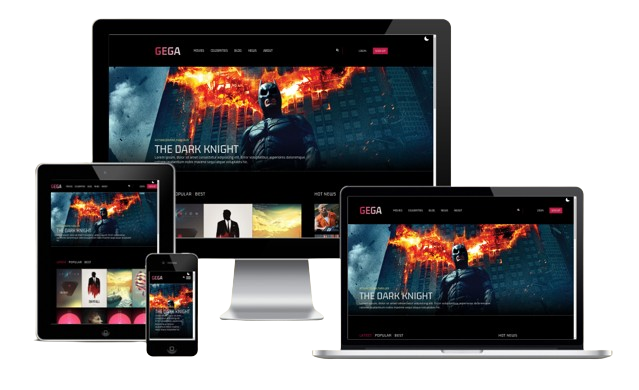

# Project – Filmothek

This project is a movie library that allows you to watch movie trailers. It was developed using React and Tailwind CSS. Since it does not use an API, it is primarily intended as a practice project. The project utilizes various hooks such as useState, useContext, and useEffect. It also features a dark mode.

## Table of contents

- [Overview](#overview)
  - [Screenshot](#screenshot)
  - [Links](#links)
- [My process](#my-process)
  - [Built with](#built-with)
  - [Frameworks](#frameworks)
  - [Tools](#tools)
  - [What I learned](#what-i-learned)
- [Author](#author)

## Overview

### Screenshot

### Links

- Solution URL: [Github Solutions](https://github.com/Adem-Tozlu/Filmothek-Website)
- Live Site URL: [Website Filmothek](https://filmothek-website.vercel.app/)

## My process

### Built with

- Semantic HTML5 markup
- Tailwind
- Mobile-design
- Flex/Grid
- Javascript

## Frameworks
 - React
 - Tailwind

## Hooks
 - useState
 - useEffect
 - useContext
 

## Tools
 - Vite

### What I learned

Developing this project allowed me to put my React skills and knowledge into practice while also gaining experience with Tailwind CSS. These experiences will undoubtedly be beneficial to me in my further career as a developer.
## Author

- Website - [Github](https://github.com/Adem-Tozlu)
- Frontend Mentor – [@Adem-Tozlu](https://www.frontendmentor.io/profile/Adem-Tozlu)
- Linkedin - [@Adem-Tozlu](https://www.linkedin.com/in/adem-tozlu)