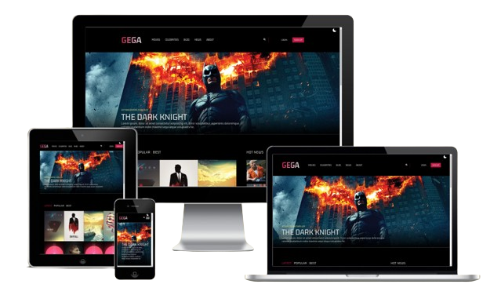

# Project – Filmothek
Dieses Projekt ist eine Filmothek, mit der du Filmtrailer ansehen kannst. Es wurde mit React und Tailwind CSS entwickelt. Da es keine API verwendet, dient es hauptsächlich als Übungsprojekt. Im Projekt wurden verschiedene Hooks wie useState, useContext und useEffect eingesetzt. Außerdem verfügt es über einen Dark-Modus.

## Inhaltsverzeichnis

- [Übersicht](#overview)
  - [Screenshot](#screenshot)
  - [Links](#links)
- [Mein Prozess](#mein-prozess)
  - [Erstellt mit](#erstellt-mit)
  - [Frameworks](#frameworks)
  - [Tools](#tools)
  - [Was ich gelernt habe](#was-ich-gelernt-habe)
- [Author](#author)

## Überblick

### Screenshot

### Links

- Solution URL: [Github Solutions](https://github.com/Adem-Tozlu/Filmothek-Website)
- Live Site URL: [Website Filmothek](https://filmothek-website.vercel.app/)

## Mein Prozess

### Erstellt mit

- Semantic HTML5 markup
- Tailwind
- Mobile-design
- Flex/Grid
- Javascript

## Frameworks

- React
- Tailwind

## Hooks

- useState
- useEffect
- useContext

## Tools

- Vite

### Was ich gelernt habe

Die Entwicklung dieses Projekts ermöglichte es mir, meine React-Kenntnisse und -Fähigkeiten in der Praxis anzuwenden und gleichzeitig Erfahrungen mit Tailwind CSS zu sammeln. Diese Erfahrungen werden mir in meiner weiteren beruflichen Laufbahn als Entwickler zweifellos von Nutzen sein.

## Author

- Website - [Github](https://github.com/Adem-Tozlu)
- Frontend Mentor – [@Adem-Tozlu](https://www.frontendmentor.io/profile/Adem-Tozlu)
- Linkedin - [@Adem-Tozlu](https://www.linkedin.com/in/adem-tozlu)